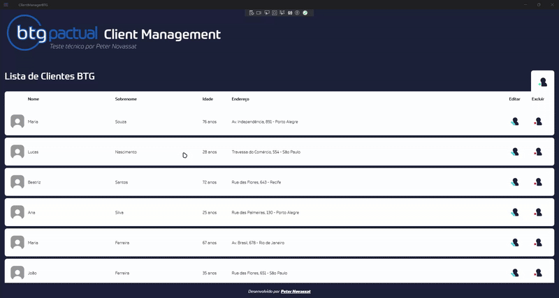
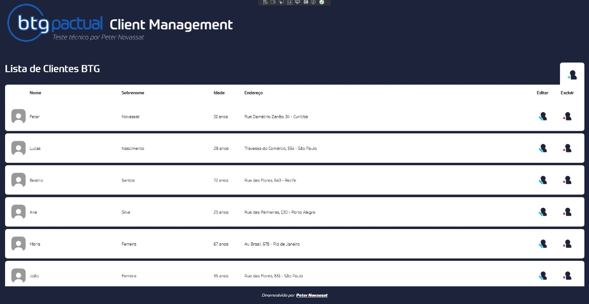
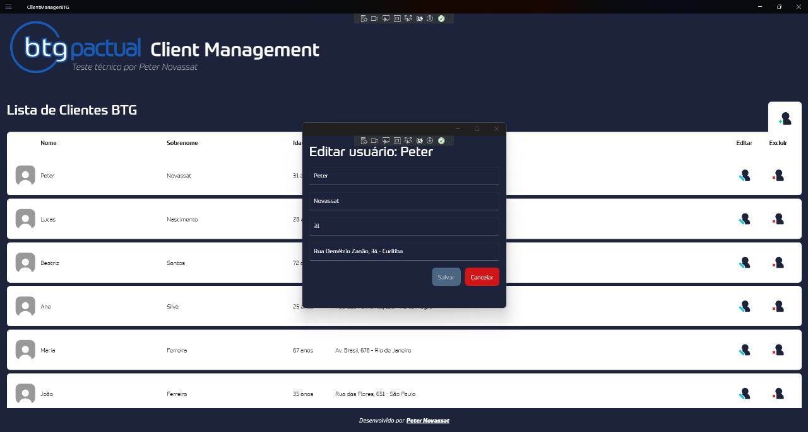
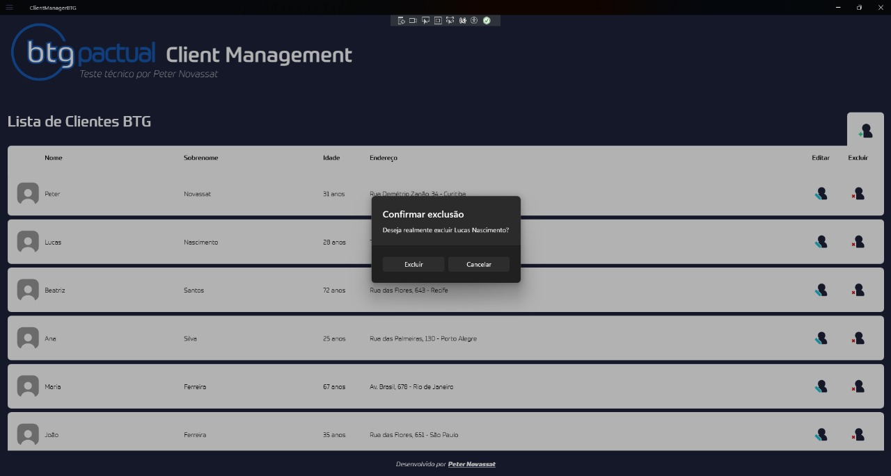
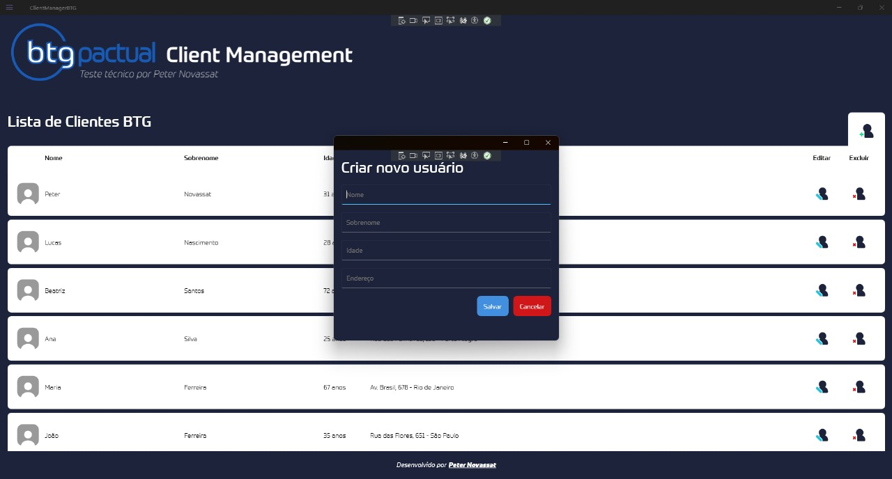

# ClientManagerBTG (.NET MAUI - Windows)

Este projeto foi desenvolvido como parte do teste técnico para a vaga de desenvolvedor no **BTG Pactual**.  
A aplicação consiste em um sistema de gerenciamento de clientes, utilizando **.NET MAUI para Windows**, com foco em boas práticas de arquitetura, experiência do usuário e manutenibilidade.

## 🎯 Funcionalidades

- ✅ Listagem de clientes com visual limpo e ordenado
- ✅ Cadastro de novo cliente com validação de campos
- ✅ Edição de cliente com validação, destaque e controle visual
- ✅ Exclusão com confirmação
- ✅ Cada ação abre em uma nova janela (janela principal permanece aberta)
- ✅ Cliente adicionado ou editado é destacado com animação (UX aprimorada)

## 🧱 Tecnologias Utilizadas

- .NET MAUI 9 (Windows Desktop)
- CommunityToolkit.MVVM (MVVM simplificado)
- SQLite-net para persistência local
- Injeção de dependência nativa do MAUI
- WeakReferenceMessenger para comunicação entre telas
- VisualStateManager para feedback visual em botões
- Custom Behaviors para animações por estado

## 📂 Arquitetura

A arquitetura segue o padrão **Vertical Slice** com separação por feature:

```
Features/
└── Clients/
    ├── List/
    └── Edit/
Shared/
├── Models/
├── Entities/
├── Services/
├── Repository/
└── Messages/
```

- **ClientModel**: usado pela UI
- **ClientEntity**: usado para persistência (com `implicit operator`)
- **BaseViewModel**: centraliza comandos reutilizáveis
- **WindowService**: gerencia janelas, centralização e injeção via construtor

## 💡 Diferenciais Técnicos

- 🔄 Animação visual para clientes adicionados e editados
- 🔒 Validação de campos com feedback direto ao usuário
- 🧠 Botão “Salvar” só habilita se houver alterações reais
- ⚙️ Arquivo `clients.json` embutido e carregado automaticamente no primeiro uso
- ✨ Estilo visual dinâmico com `VisualStateManager`

## 🧪 Requisitos do Desafio

| Requisito                                       | Atendido |
|------------------------------------------------|----------|
| MAUI para Windows                              | ✅        |
| MVVM                                           | ✅        |
| CRUD com tela separada por ação                | ✅        |
| Injeção de dependência                         | ✅        |
| Confirmação na exclusão                        | ✅        |
| Validação de campos                            | ✅        |
| Persistência com SQLite                        | ✅        |
| Animações e feedback visual                    | ✅✅       |
| Arquitetura escalável                          | ✅✅       |

## ▶️ Como executar

1. Clone o repositório:
   ```bash
   git clone https://github.com/NovassatSystems/ClientManagerBTG.git
   ```

2. Abra no Visual Studio 2022 com suporte a .NET MAUI

3. Selecione a plataforma `Windows Machine` e execute (`F5`)

> O banco SQLite será carregado com 100 clientes fictícios na primeira execução.

## ▶️ Demonstração em vídeo



## 🖼️ Capturas de Tela

| Tela Inicial                     | Edição de Cliente                  |
|----------------------------------|------------------------------------|
|  |  |

| Confirmação de Exclusão          | Cadastro de Novo Cliente           |
|----------------------------------|------------------------------------|
|  |  |


---

## 👨‍💻 Autor

Desenvolvido por **Peter Novassat**  
📧 novassatsystems@gmail.com  
🔗 [linkedin.com/in/peternovassat](https://linkedin.com/in/peternovassat)

---

> Projeto construído com foco em código limpo, UX clara e arquitetura escalável.  
> Agradeço pela oportunidade de participar do processo técnico!
